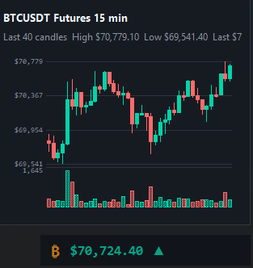
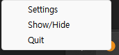
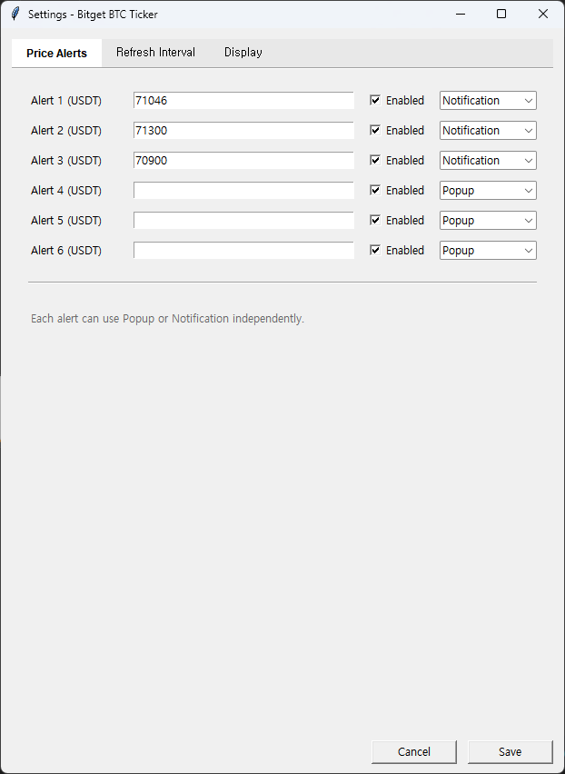
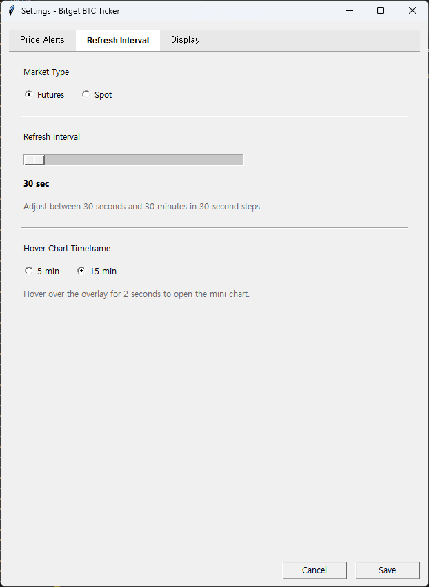
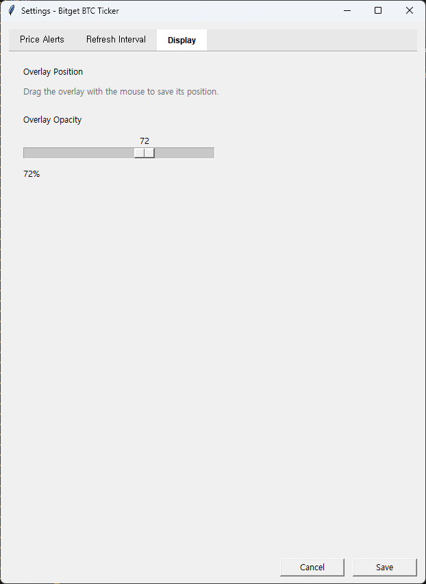

# Bitget BTC Ticker

A lightweight, floating desktop widget that displays the real-time Bitcoin (BTC/USDT) price directly fetched from the Bitget API (V2).

The widget runs completely in the background without title bars, sits on top of other windows, and provides an unobtrusive experience for monitoring the BTC price.

## Screenshots

### Overlay Widget & Hover Chart

Hover over the overlay for 2 seconds to open a mini candlestick chart with volume bars.



### Context Menu

Right-click the overlay or the system tray icon to access the menu.



### Settings — Price Alerts

Set up to 6 target prices with independent `Popup` or `Notification` mode per alert.



### Settings — Refresh Interval

Choose Futures or Spot market, set the polling interval, and select the hover chart timeframe.



### Settings — Display

Adjust overlay opacity. Drag the overlay itself to reposition and auto-save its location.



---

## Features

- **Live BTC/USDT Price**, updated automatically based on your polling interval.
- **Floating Overlay** widget that always stays on top of other applications.
- **Hover Candlestick Chart** with volume bars — appears when hovering over the overlay for 2 seconds (5 min or 15 min timeframe).
- **Show/Hide Toggle** — hide the overlay without quitting, via right-click menu or system tray.
- **Customizable Appearance** including transparency (opacity) and drag-to-save overlay placement.
- **Selectable Market Type** with `Futures` as the default source and `Spot` as an optional fallback.
- **Flexible Polling Interval** adjustable from 30 seconds up to 30 minutes.
- **Visual Direction Indicators**: Colors and arrows adjust dynamically (up=green ▲, down=red ▼).
- **Price Alarms**: Set up to 6 target prices, enable or disable each alert individually, and choose `Popup` or silent `Notification` mode per alert.
- **System Tray Integration**: Easily access settings, show/hide, or exit through a discrete tray icon.

## Requirements

- **Python**: 3.10 or higher
- **OS**: Windows (Recommended for optimal overlay/background execution)

## Installation

```bash
git clone git@github.com:bari-psy77/Bitget-BTC-Ticker.git
cd Bitget-BTC-Ticker
pip install -r requirements.txt
```

*(Dependencies include: `pystray`, `Pillow`, `requests`)*

## Running the Application

Double-click `run.bat` on Windows, or use the following command to start it silently:
```bash
pythonw main.py
```

## How to Use

1. **Reposition Widget**: By default, the widget appears near the bottom-right of your screen. Click and drag anywhere on the widget to move it. Dragging always saves the current position.
2. **Hover Chart**: Hover over the overlay for 2 seconds to open a mini candlestick chart with price levels and volume bars.
3. **Show/Hide**: Right-click the overlay or tray icon and select **Show/Hide** to toggle visibility without quitting.
4. **Settings Menu**: Right-click the widget or the tray icon and click **Settings**.
5. **Configure Settings**:
   - **Price Alerts Tab**: Input up to 6 target price triggers, toggle each one on or off, and choose `Popup` or `Notification` per alert.
   - **Refresh Interval Tab**: Choose `Futures` or `Spot`, adjust how often the price is fetched (30 sec – 30 min), and select the hover chart timeframe (5 min / 15 min).
   - **Display Tab**: Use the opacity slider to make the ticker semi-transparent. Drag the overlay to set its position.

## Compiled Windows Executable (.exe)

Don't want to install Python?
A GitHub Actions workflow automatically builds a standalone `Bitget-BTC-Ticker.exe` upon new updates. Download the latest zipped executable from the **[Actions]** tab of this repository under the *Bitget-BTC-Ticker-Windows-Exe* artifact.
